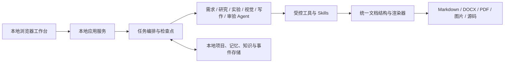

# PaperAgent

PaperAgent 是一款面向 Windows 个人用户的本地论文与报告智能工作台。它通过浏览器界面组织需求澄清、资料处理、实验执行、图表生成、写作审验、定向修订和多格式交付，并保留项目、会话、产物与断点状态。

> 当前版本：`0.1.0`  
> 支持平台：Windows 10/11 x64  
> 使用许可：允许个人及非商业用途；未经书面授权禁止第三方商业使用，详见 [LICENSE](LICENSE)。

## 主要能力

- 项目与多会话管理：不同任务可独立运行、切换和恢复。
- 自然语言需求理解：识别论文、实验报告、课题报告、技术文档、产品方案、会议纪要、公文等文体，并在必要时请求澄清。
- 多 Agent 协作：按任务动态组织需求分析、资料研究、实验、视觉内容、写作和审验，不依赖固定的单一路径。
- 本地实验执行：在授权边界内创建和复用 `uv` 虚拟环境、运行 Python、保存源码、数据和结果图。
- 知识与证据管理：导入 PDF、Word、Markdown、文本和代码资料，支持本地检索、引用与来源追踪。
- 图表与图片：生成实验数据图、流程图和可选的生成式图片，并将有效图片编入文档。
- 专业文档排版：支持封面、用户信息、标题层级、字体字号、页边距、页眉页脚、公式、表格、图片、目录和参考文献。
- 多格式交付：生成并预览 Markdown、DOCX 和 PDF，产物可单独下载。
- 审验与修复闭环：根据具体问题定位内容、结构、排版或工具故障，制定修复策略后从受影响节点继续。
- 本地记忆与断点恢复：保存会话内上下文、长期偏好、执行事件和产物关系；用户可查看和清理。

## 整体架构



所有核心服务默认只监听 `127.0.0.1`。模型请求仅发送给用户主动配置的服务商；项目资料、会话、产物与运行记录默认保存在本机。

## 方式一：安装包使用（推荐）

1. 在 GitHub 仓库的 **Releases** 页面下载：
   - `PaperAgent-0.1.0-Setup.exe`：安装版。
   - `SHA256SUMS.txt`：文件校验值。
   - 或下载 `PaperAgent-0.1.0-windows-x64.zip`：免安装便携版。
2. 在下载目录验证安装包：

   ```powershell
   Get-FileHash .\PaperAgent-0.1.0-Setup.exe -Algorithm SHA256
   ```

   将输出与 `SHA256SUMS.txt` 对照。
3. 运行安装程序并按提示完成安装。安装为当前用户级别，通常不需要管理员权限。
4. 从开始菜单或桌面快捷方式启动 PaperAgent。
5. 首次进入“设置”，添加文本模型的 API URL、模型名称和 API Key；需要生图时再单独配置图片模型。

安装包已包含 PaperAgent 运行所需的 Python 运行时。由于当前发布包尚未购买商业代码签名证书，Windows SmartScreen 可能显示未知发布者提示；请先核对 SHA-256，再决定是否运行。

便携版解压后运行 `PaperAgent.exe` 即可，不要只从压缩包内部直接双击。

## 方式二：从源码一键启动

### 必需环境

| 环境 | 建议版本 | 官方安装入口 | 用途 |
|---|---:|---|---|
| Windows | 10/11 x64 | [Microsoft Windows](https://www.microsoft.com/windows/) | 当前首发平台 |
| Git | 最新稳定版 | [Git for Windows](https://git-scm.com/download/win) | 获取与更新源码 |
| Python | 3.12.x | [Python 3.12 下载](https://www.python.org/downloads/) | 后端与本地工具运行时 |
| uv | 最新稳定版 | [uv 官方安装说明](https://docs.astral.sh/uv/getting-started/installation/) | Python 环境和依赖管理 |
| Node.js | 22 LTS | [Node.js 下载](https://nodejs.org/en/download) | 构建前端界面 |

安装 Python 时建议勾选 **Add Python to PATH**。安装完毕后重新打开 PowerShell，并检查：

```powershell
git --version
python --version
uv --version
node --version
npm --version
```

### 获取与启动

```powershell
git clone <你的仓库地址>
Set-Location .\PaperAgent
powershell.exe -NoProfile -ExecutionPolicy Bypass -File .\scripts\start-local.ps1 Start -RebuildFrontend
```

启动脚本会自动同步 Python 环境、安装前端依赖、构建界面、选择可用本地端口并打开浏览器。首次启动因下载依赖会更久；之后会复用环境。

常用命令：

```powershell
# 查看状态
.\scripts\start-local.ps1 Status

# 查看日志
.\scripts\start-local.ps1 Logs

# 停止前后端及托盘进程
.\scripts\start-local.ps1 Stop

# 运行快速本地验收
.\scripts\test-local.ps1 -Mode Quick
```

如果 PowerShell 阻止脚本运行，可仅为当前窗口执行：

```powershell
Set-ExecutionPolicy -Scope Process Bypass
```

## 模型配置

PaperAgent 不内置第三方模型凭据。首次使用时，在界面“设置”中分别配置文本模型和图片模型：

- 文本模型：OpenAI、Anthropic/Claude、Gemini、DeepSeek、豆包、Xiaomi MiMo、Ollama，以及兼容 OpenAI API 的自定义服务。
- 图片模型：Seedream、OpenAI Image，以及兼容接口。
- 每项配置包含 API URL、模型名称和 API Key；本地 Ollama 通常可以不填 Key。

凭据不会写入仓库、日志或普通配置文件；Windows 下使用系统安全能力加密保存。使用在线模型时，提交给模型的内容会受相应服务商隐私政策约束。敏感资料可在项目中关闭外发。

## 可选第三方环境

基础聊天、资料整理、Markdown/DOCX 生成和界面预览不要求安装下列软件。只有启用对应能力时才需要：

| 组件 | 官方入口 | 适用场景 |
|---|---|---|
| TeX Live | [Windows 安装说明](https://tug.org/texlive/windows.html) · [官方安装器](https://mirror.ctan.org/systems/texlive/tlnet/install-tl-windows.exe) | 高质量学术 PDF、复杂公式和 LaTeX 模板；完整安装需要较大磁盘空间 |
| Pandoc | [安装说明](https://pandoc.org/installing.html) | 更多文档格式转换与模板链路 |
| Typst | [官方发行版](https://github.com/typst/typst/releases) | 轻量、快速的可选 PDF 排版引擎 |
| LibreOffice | [官方下载](https://www.libreoffice.org/download/download-libreoffice/) | 无 Microsoft Word 时的 Office 预览或转换辅助 |
| PDFMathTranslate-next | [项目主页](https://github.com/PDFMathTranslate/PDFMathTranslate-next) | 含数学公式 PDF 的中英翻译；作为独立可选工具使用 |
| NVIDIA CUDA | [CUDA Toolkit](https://developer.nvidia.com/cuda-downloads) | 用户明确授权并且本机 GPU 适合的计算实验 |
| Ollama | [官方下载](https://ollama.com/download/windows) | 完全本地的兼容模型服务 |

Microsoft Word 不是生成 DOCX 的必要条件。若希望获得与 Word 打开效果完全一致的 PDF，可选择在本机安装 Word 并使用相应转换链路；PaperAgent 同时保留 DOCX 与 PDF，不会只保留转换后的文件。

## 数据位置与清理

- 安装版默认数据目录：`%LOCALAPPDATA%\PaperAgent\data`
- 源码版默认数据目录：项目同级的 `paperagent-data`
- 可通过环境变量 `PAPERAGENT_DATA_DIR` 指定其他位置。

数据目录包含项目、会话、知识条目、检查点、实验环境索引和生成产物。界面提供记忆查看与清理能力；清理操作不可逆，请先备份需要保留的内容。

## 从源码构建发布包

维护者除“必需环境”外，还需安装 [Inno Setup](https://jrsoftware.org/isdl.php)，并确保 `ISCC.exe` 可被脚本发现，然后执行：

```powershell
powershell.exe -NoProfile -ExecutionPolicy Bypass -File .\scripts\build_release.ps1
powershell.exe -NoProfile -ExecutionPolicy Bypass -File .\scripts\check-release-candidate.ps1 -RequireArtifacts
```

生成物位于 `dist\release`。正式发布前必须保留 `SHA256SUMS.txt`，并完成安装版、便携版、首次启动、模型连接、实验执行、DOCX/PDF 渲染和断点恢复验收。

## 项目目录

```text
backend/      本地 API、Agent、工具、记忆与文档服务
frontend/     浏览器工作台
launcher/     桌面启动器与单实例管理
skills/       可装载的领域能力
knowledge/    内置公开知识内容
scripts/      一键启动、测试与发布脚本
installer/    Windows 安装包配置
tests/        自动化测试
docs/         用户、部署、安全与发布说明
```

更详细的使用方式见 [用户指南](docs/user-guide.md)，安全边界见 [威胁模型与安全说明](docs/security/threat-model.md)，第三方组件许可见 [THIRD_PARTY_NOTICES.md](THIRD_PARTY_NOTICES.md)。

## 许可与贡献

本项目采用 PolyForm Noncommercial License 1.0.0。允许学习、研究、个人使用和其他非商业用途；未经项目所有者书面许可，不得将本项目或其衍生服务用于商业用途。

提交 Issue 时请勿上传 API Key、私人论文、未公开实验数据或包含个人路径的日志。贡献代码前请先运行快速验收，并确保没有把本地数据目录、虚拟环境、构建产物或凭据加入提交。
